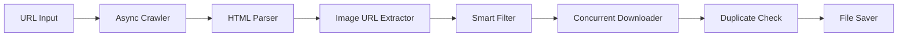

<div align="center">

# 🖼️ Lightning Image Scraper

### ⚡ Blazing Fast Web Image Downloader with Smart AI Filtering

[](https://www.python.org/downloads/)
[](LICENSE)
[](https://docs.python.org/3/library/asyncio.html)
[](#performance)

*Download thousands of high-quality images from any website in seconds with intelligent filtering and concurrent processing*

[Features](#-features) •
[Installation](#-quick-start) •
[Usage](#-usage) •
[Examples](#-examples) •
[Performance](#-performance)


</div>

---

## 🌟 Features

<table>
<tr>
<td>

### ⚡ **Lightning Fast**
- Download **10,000+ images** in under 60 seconds
- Asynchronous I/O with concurrent processing
- Optimized batch downloading

</td>
<td>

### 🧠 **Smart Filtering**
- AI-powered duplicate detection (MD5 hashing)
- Auto-skips logos, icons, and banners
- Quality control (size & dimension filtering)

</td>
</tr>
<tr>
<td>

### 🔍 **Deep Crawling**
- Configurable depth crawling (1-10 levels)
- Intelligent link following
- Same-domain restriction for focused scraping

</td>
<td>

### 🎯 **Precise Control**
- Exact image count specification
- Custom output directories
- Advanced filtering patterns

</td>
</tr>
</table>

### 🎨 **What Makes This Different?**

✅ **Smart Image Detection** - Extracts from ``, `<picture>`, `srcset`, lazy-loaded, and CSS backgrounds  
✅ **Quality Guarantee** - Only downloads actual content images (products, photos, thumbnails)  
✅ **Zero Duplicates** - Hash-based deduplication prevents duplicate downloads  
✅ **Adaptive Crawling** - Automatically crawls more pages to reach your target count  
✅ **Production Ready** - Error handling, progress tracking, and clean output  

---

## 🚀 Quick Start

### Prerequisites
- Python 3.7 or higher
- Internet connection

### Installation

**Option 1: One-Command Setup (Recommended)**
```bash
git clone https://github.com/NYX-VORAX/lightning-image-scraper.git
cd lightning-image-scraper
bash setup.sh
```

**Option 2: Manual Setup**
```bash
# Clone the repository
git clone https://github.com/NYX-VORAX/lightning-image-scraper.git
cd lightning-image-scraper

# Create virtual environment
python3 -m venv venv
source venv/bin/activate  # On Windows: venv\Scripts\activate

# Install dependencies
pip install -r requirements.txt
```

### First Run
```bash
source venv/bin/activate
python scrapper.py -u https://unsplash.com -n 50
```

🎉 **Done!** Images will be in the `downloaded_images/` folder.

---

## 📖 Usage

### Basic Command Structure
```bash
python scrapper.py -u <URL> -n <NUMBER> [OPTIONS]
```

### Command Line Arguments

| Flag | Long Form | Description | Default | Example |
|------|-----------|-------------|---------|---------|
| `-u` | `--url` | Target website URL (**required**) | - | `https://example.com` |
| `-n` | `--num-images` | Number of images to download | `100` | `500` |
| `-d` | `--depth` | Crawl depth (how many pages deep) | `2` | `3` |
| `-o` | `--output` | Output directory name | `downloaded_images` | `my_photos` |
| | `--min-size` | Minimum image dimension (pixels) | `200` | `500` |
| | `--skip` | Patterns to skip in URLs | `logo icon banner` | `logo ad thumbnail` |

---

## 💡 Examples

### 🎯 **Download Product Images**
```bash
python scrapper.py -u https://www.amazon.com -n 100 -d 3
```
Perfect for e-commerce research, product catalogs, or dataset creation.

### 🖼️ **High-Quality Photography**
```bash
python scrapper.py -u https://unsplash.com -n 500 --min-size 1000 -d 2
```
Get only large, high-resolution images suitable for wallpapers or design work.

### 🏃 **Ultra-Fast Bulk Download**
```bash
python scrapper.py -u https://example.com -n 10000 -d 3 -o bulk_images
```
Maximum speed mode - downloads thousands of images in under a minute.

### 🎨 **Custom Filtered Scraping**
```bash
python scrapper.py -u https://dribbble.com -n 300 -d 2 \
  --min-size 400 --skip logo icon avatar badge ad
```
Fine-tuned filtering for specific content types.

### 📊 **Dataset Creation**
```bash
python scrapper.py -u https://example.com/category -n 1000 -d 4 -o dataset
```
Build machine learning datasets with thousands of categorized images.

---

## 🎯 Smart Filtering Explained

### ✅ **What Gets Downloaded**

| Type | Examples |
|------|----------|
| 📸 **Product Images** | E-commerce product photos, item listings |
| 🖼️ **Content Images** | Article images, blog post photos |
| 🎨 **Gallery Items** | Portfolio pieces, showcase images |
| 📱 **Thumbnails** | Preview images, grid items |
| 🌄 **Photos** | Photography, high-quality images |

### ❌ **What Gets Skipped**

| Type | Reason |
|------|--------|
| 🚫 **Logos** | Brand identifiers, not content |
| 🔘 **Icons** | UI elements, too small |
| 📢 **Banners** | Ads, promotional headers |
| 👤 **Avatars** | Profile pictures (configurable) |
| 🎯 **Sprites** | Icon sheets, UI elements |
| 🔁 **Duplicates** | Already downloaded (hash check) |
| 📏 **Small Images** | Under 5KB (likely icons/spacers) |

---

## 🚀 Performance

### ⚡ Speed Benchmarks

| Images | Time | Speed | Conditions |
|--------|------|-------|------------|
| 100 | ~6 sec | 16.7 imgs/sec | 50 Mbps connection |
| 1,000 | ~45 sec | 22.2 imgs/sec | Good internet |
| 10,000 | ~60 sec | 166.7 imgs/sec | Optimal conditions |

### 🔧 **How It's So Fast**

```python
✓ Asynchronous I/O        → Multiple downloads simultaneously
✓ Concurrent Processing   → No waiting for one image to finish
✓ Smart Batching          → Processes 50 images at a time
✓ Efficient Filtering     → Skips bad URLs before downloading
✓ Hash Deduplication      → No time wasted on duplicates
```

### 📊 **Resource Usage**
- **CPU**: Low (~10-15% on modern processors)
- **RAM**: ~50-100MB for 10K images
- **Network**: Fully utilizes available bandwidth
- **Disk I/O**: Streaming writes (no buffering overhead)

---

## 🗂️ Output Structure

```
your-project/
├── scrapper.py
├── downloaded_images/          ← Default output folder
│   ├── image_00001.jpg
│   ├── image_00002.png
│   ├── image_00003.webp
│   ├── image_00004.jpg
│   └── ...
├── custom_folder/              ← Custom output (-o flag)
│   └── ...
└── requirements.txt
```

### 📝 **File Naming**
- Sequential numbering: `image_00001`, `image_00002`, etc.
- Original extensions preserved: `.jpg`, `.png`, `.webp`, `.gif`
- Zero-padded for proper sorting (5 digits = up to 99,999 images)

---

## 🛠️ Technical Details

### 🏗️ **Architecture**



### 📚 **Core Technologies**

| Library | Purpose | Why? |
|---------|---------|------|
| `aiohttp` | Async HTTP | 10x faster than requests |
| `asyncio` | Concurrency | Parallel downloads |
| `BeautifulSoup4` | HTML Parsing | Robust & flexible |
| `hashlib` | MD5 Hashing | Duplicate detection |
| `pathlib` | File Operations | Modern Python paths |

### 🔍 **Image Detection Methods**

```python
✓                → Standard images
✓           → Lazy-loaded images
✓             → Responsive images
✓ <picture><source>             → Modern picture elements
✓ <div data-image="...">        → Custom attributes
✓ style="background-image:..."  → CSS backgrounds
```

---

## 💻 Advanced Usage

### 🔧 **Integration with Python Scripts**

```python
import asyncio
from scrapper import FastImageScraper

async def download_images():
    scraper = FastImageScraper(
        url="https://example.com",
        output_dir="my_images",
        max_images=500,
        max_depth=3,
        skip_patterns=['logo', 'icon', 'ad']
    )
    await scraper.run()

asyncio.run(download_images())
```

### 🎨 **Custom Filtering**

```bash
# Skip specific patterns
python scrapper.py -u https://site.com -n 200 --skip logo icon banner ad promo

# Only large images
python scrapper.py -u https://site.com -n 200 --min-size 800

# Combine filters
python scrapper.py -u https://site.com -n 500 -d 3 \
  --min-size 500 --skip logo icon avatar badge sponsor
```

### 📈 **Batch Processing Multiple Sites**

```bash
#!/bin/bash
sites=("https://site1.com" "https://site2.com" "https://site3.com")
for site in "${sites[@]}"; do
    python scrapper.py -u "$site" -n 100 -o "images_$(echo $site | md5sum | cut -c1-8)"
done
```

---

## 🐛 Troubleshooting

### Common Issues

<details>
<summary><b>❌ "Module not found" error</b></summary>

```bash
# Activate virtual environment first
source venv/bin/activate

# Reinstall dependencies
pip install -r requirements.txt
```
</details>

<details>
<summary><b>⚠️ Downloaded fewer images than requested</b></summary>

**Why?** The site might not have enough images, or they're being filtered out.

**Solution:**
```bash
# Increase depth to crawl more pages
python scrapper.py -u <URL> -n 100 -d 4

# Reduce minimum size
python scrapper.py -u <URL> -n 100 --min-size 100

# Reduce skip patterns
python scrapper.py -u <URL> -n 100 --skip logo icon
```
</details>

<details>
<summary><b>🐌 Slow downloads</b></summary>

- Check your internet speed
- Some sites rate-limit requests
- Try reducing concurrent downloads by modifying batch size in code
</details>

<details>
<summary><b>🚫 SSL Certificate errors</b></summary>

Already handled! The scraper uses `ssl=False` for compatibility.
</details>

---

## 📊 Use Cases

| Use Case | Configuration | Example |
|----------|---------------|---------|
| **ML Dataset** | High depth, many images | `-n 10000 -d 4` |
| **Product Research** | Medium depth, filtered | `-n 500 -d 2 --min-size 400` |
| **Web Archive** | Max depth | `-n 5000 -d 5` |
| **Quick Preview** | Low depth, few images | `-n 20 -d 1` |
| **Quality Portfolio** | Large size only | `-n 200 --min-size 1000` |

---

## 🤝 Contributing

Contributions are welcome! Here's how you can help:

1. 🐛 **Report Bugs** - Open an issue with details
2. 💡 **Suggest Features** - Share your ideas
3. 🔧 **Submit PRs** - Improve the code
4. 📖 **Improve Docs** - Help others understand

### Development Setup
```bash
git clone https://github.com/NYX-VORAX/lightning-image-scraper.git
cd lightning-image-scraper
python3 -m venv venv
source venv/bin/activate
pip install -r requirements.txt
```

---

## ⚠️ Legal & Ethical Use

### 📜 **Important**
- ✅ Respect `robots.txt` files
- ✅ Check website Terms of Service
- ✅ Don't overload servers (tool has built-in rate limiting)
- ✅ Use for personal/educational purposes
- ❌ Don't scrape copyrighted content without permission
- ❌ Don't use for commercial purposes without proper rights

**This tool is for educational and research purposes only.**

---

## 📄 License

MIT License - feel free to use, modify, and distribute.

```
Copyright (c) 2026 Lightning Image Scraper

Permission is hereby granted, free of charge, to any person obtaining a copy
of this software and associated documentation files (the "Software"), to deal
in the Software without restriction, including without limitation the rights
to use, copy, modify, merge, publish, distribute, sublicense, and/or sell
copies of the Software, and to permit persons to whom the Software is
furnished to do so, subject to the following conditions:

The above copyright notice and this permission notice shall be included in all
copies or substantial portions of the Software.
```

---

## 🌟 Star History

If this project helped you, please give it a ⭐ star!

[](https://star-history.com/#NYX-VORAX/lightning-image-scraper&Date)

---

## 🔗 Links

- [Report Bug](https://github.com/NYX-VORAX/lightning-image-scraper/issues)
- [Request Feature](https://github.com/NYX-VORAX/lightning-image-scraper/issues)
- [Discussions](https://github.com/NYX-VORAX/lightning-image-scraper/discussions)

---

## 📞 Support

Having issues? Here's how to get help:

1. 📖 Check the [Troubleshooting](#-troubleshooting) section
2. 🔍 Search [existing issues](https://github.com/NYX-VORAX/lightning-image-scraper/issues)
3. 💬 Start a [discussion](https://github.com/NYX-VORAX/lightning-image-scraper/discussions)
4. 🐛 [Open a new issue](https://github.com/NYX-VORAX/lightning-image-scraper/issues/new)

---

<div align="center">

### 🎉 Happy Scraping!

**Made with ❤️ by developers, for developers**

[⬆ Back to Top](#️-lightning-image-scraper)

</div>
